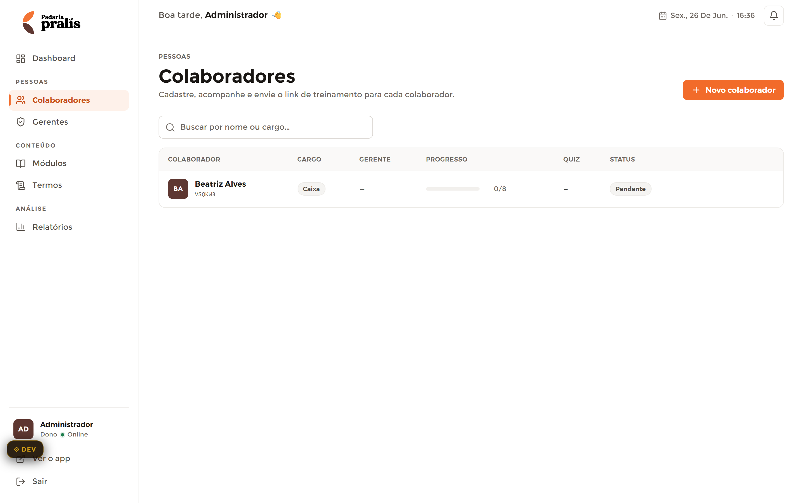

# Colaboradores — Admin

**Mundo:** ☀️ Admin (CMS) · **Rota:** `/admin/colaboradores`

## Objetivo
Cadastrar colaboradores, acompanhar o progresso de cada um e enviar o link de treinamento — a lista-mestre de pessoas que recebem a trilha.

## Hierarquia visual
1. **AdminPageHeader** (eyebrow `PESSOAS` + h1 "Colaboradores" + subtítulo) com a única ação accent **"+ Novo colaborador"** alinhada à direita — primeiro foco.
2. **Campo de busca** ("Buscar por nome ou cargo…") logo abaixo, largura cheia.
3. **Tabela herói** com cabeçalho em eyebrow (COLABORADOR · CARGO · GERENTE · PROGRESSO · QUIZ · STATUS) e a linha do colaborador (Avatar BA + nome + código, pill "Caixa", barra de progresso 0/8, StatusBadge "Pendente").

## Fluxo do usuário
Entra → busca/varre a tabela → clica numa linha para ver a visão 360 do colaborador, ou aciona "+ Novo colaborador" para cadastrar → envia o link de treinamento.

## Componentes utilizados
`AdminLayout`, `AdminSidebar`, `AdminTopbar`, `AdminPageHeader` (+1 ação accent), campo de busca, **tabela herói** (linhas ~48px, header eyebrow, ações no hover), `Avatar` (iniciais), pill de cargo, barra de progresso, `StatusBadge` ("Pendente"), `EmptyState` (quando sem resultados).

## Tokens / identidade
`color.admin.accent` no botão "+ Novo colaborador" (1/tela); header de tabela em `typography.scaleAdmin.eyebrow`; linhas com `color.admin.border`; `StatusBadge` em `radius.pill` com cor+ícone+texto; progresso e quiz em `typography.numeric` tabular. Sem dourado.

