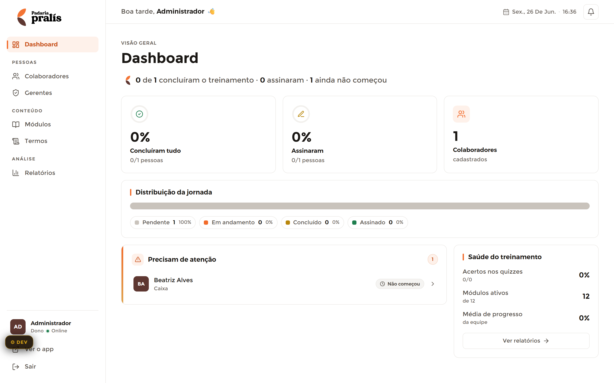

# Dashboard — Admin (Visão Geral)

**Mundo:** ☀️ Admin (CMS) · **Rota:** `/admin` (Dashboard)

## Objetivo
Dar ao dono/gerente o pulso do treinamento num relance: quantos concluíram, assinaram e quem precisa de atenção — sem precisar abrir relatórios.

## Hierarquia visual
1. **Título "Dashboard"** (eyebrow `VISÃO GERAL` + h1) com a linha-resumo viva (`0 de 1 concluir o treinamento · 0 assinaram · 1 ainda não começou`) — primeira leitura, contexto imediato.
2. **Fileira de 3 StatCards** (Concluíram tudo 0% · Assinaram 0% · Colaboradores 1) — os KPIs com count-up saltam logo abaixo.
3. **"Distribuição da jornada"** (barra empilhada + legenda Pendente/Em andamento/Concluído/Assinado) e, em terceiro plano, os dois SectionCards inferiores: **"Precisam de atenção"** (com StatusBadge "Não começou") e **"Saúde do treinamento"** (acertos, módulos ativos, média de progresso + CTA "Ver relatórios").

## Fluxo do usuário
Entra logado → lê a linha-resumo → varre os 3 KPIs → identifica em "Precisam de atenção" quem está parado → clica "Não começou"/linha para agir ou "Ver relatórios →" para o detalhamento.

## Componentes utilizados
`AdminLayout`, `AdminSidebar` (grupos Pessoas/Conteúdo/Análise), `AdminTopbar` (saudação "Boa tarde, Administrador" + data viva + sino), `AdminPageHeader` (eyebrow+título), `StatCard` (×3, count-up), `SectionCard` (Distribuição / Precisam de atenção / Saúde), `StatusBadge` ("Não começou"), `Avatar` (BA), barra de distribuição empilhada.

## Tokens / identidade
Fundo `color.admin.bgApp`; 1 só accent `color.admin.accent` por tela (CTA/realces); KPIs em `typography.scaleAdmin.kpi` tabular com `motion.durations.kpiCountUp`; cards com **borda** `color.admin.border` (`elevation._principle`), nunca sombra; status sempre cor+ícone+texto (`accessibility.statusRule`). Sem dourado na UI.

