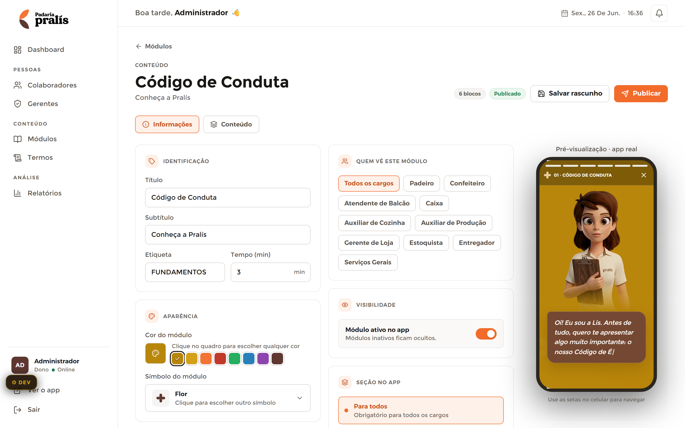

# Editor de Módulo — Admin

**Mundo:** ☀️ Admin (CMS) · **Rota:** `/admin/modulos/:id` (editor)

## Objetivo
Criar/editar um módulo com edição à esquerda e **preview real** do StoryPlayer à direita — o que se edita é exatamente o que o colaborador verá.

## Hierarquia visual
1. **Cabeçalho do editor**: breadcrumb "← Módulos", eyebrow `CONTEÚDO`, título "Código de Conduta" + subtítulo, e à direita o cluster de ações **"6 blocos · Publicado · Salvar rascunho · Publicar"** (accent só em "Publicar").
2. **Abas** "Informações" (ativa) e "Conteúdo".
3. **Coluna de edição (esquerda)** em SectionCards: IDENTIFICAÇÃO (título, subtítulo, etiqueta, tempo), APARÊNCIA (cor do módulo via swatches, símbolo/ModuleIcon), QUEM VÊ ESTE MÓDULO (chips de cargos, "Todos os cargos" ativo), VISIBILIDADE (toggle "Módulo ativo no app"), SEÇÃO NO APP ("Para todos").
4. **Painel de pré-visualização (direita)** — rótulo "Pré-visualização · app real" + frame de celular dark renderizando o StoryPlayer real (Lis + LisCard).

## Fluxo do usuário
Abre o módulo → ajusta Informações (textos, cor, ícone, cargos, visibilidade) ou troca para Conteúdo (timeline de blocos) → vê o reflexo no preview real à direita → "Salvar rascunho" ou "Publicar".

## Componentes utilizados
`AdminModuloEditor` (abas Informações/Conteúdo + timeline), `AdminPageHeader`/cabeçalho com breadcrumb e ações, `SectionCard` (×5), inputs (título/subtítulo/etiqueta/tempo), swatches de cor, seletor de `ModuleIcon` ("Flor"), chips de cargos, **toggle** de visibilidade, `StatusBadge` ("Publicado"), **`ModulePreview`** (StoryPlayer real no frame 300×600, `preview=true`), `SlideEditor`/`QuizEditor`/`PollSlideEditor` na aba Conteúdo.

## Tokens / identidade
Abas e "Publicar" usam `color.admin.accent` (aba ativa + 1 ação primária); SectionCards com borda `color.admin.border`, `radius.lg`; inputs `radius.md` + `spacing.usage.inputPadding`. O **frame de preview é o mundo 🌙** dentro do admin: usa `color.appDark.*`, Lis, `LisCard`, `StoryProgressBar` — reuso do player real, sem clone. Sem auto-advance no preview.

