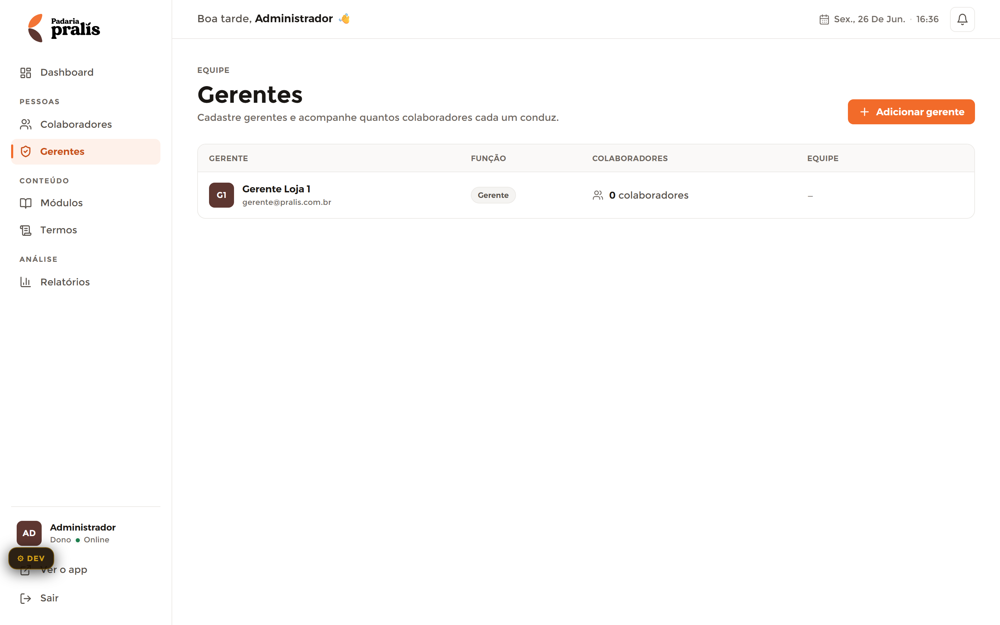

# Gerentes — Admin

**Mundo:** ☀️ Admin (CMS) · **Rota:** `/admin/gerentes`

## Objetivo
Cadastrar gerentes e ver quantos colaboradores cada um conduz — porta de entrada para o drill-down 360 Gerente → Equipe → Colaborador.

## Hierarquia visual
1. **AdminPageHeader** (eyebrow `EQUIPE` + h1 "Gerentes" + subtítulo) com a ação accent **"+ Adicionar gerente"** à direita.
2. **Tabela herói** com header eyebrow (GERENTE · FUNÇÃO · COLABORADORES · EQUIPE).
3. **Linha do gerente** (Avatar G1 + "Gerente Loja 1" + e-mail, pill "Gerente", ícone+"0 colaboradores", coluna EQUIPE vazia "–").

## Fluxo do usuário
Entra → varre a lista de gerentes → clica numa linha para abrir o drill-down da equipe daquele gerente, ou aciona "+ Adicionar gerente" para cadastrar.

## Componentes utilizados
`AdminLayout`, `AdminSidebar`, `AdminTopbar`, `AdminPageHeader` (+1 ação accent), **tabela herói** (linhas ~48px, header eyebrow), `Avatar` (G1), pill de função "Gerente", contagem com `Icon` de pessoas, `EmptyState` (sem gerentes).

## Tokens / identidade
`color.admin.accent` na ação "+ Adicionar gerente" (1/tela); header de tabela `typography.scaleAdmin.eyebrow`; linhas `color.admin.border`; contagem em `typography.numeric`; pill `radius.pill`. Sem dourado na UI.

