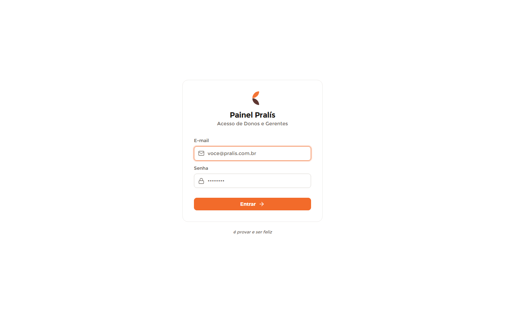

# Login — Admin (Painel Pralís)

**Mundo:** ☀️ Admin (CMS) · **Rota:** `/admin/login`

## Objetivo
Autenticar donos e gerentes no painel — entrada mínima, focada, sem distração.

## Hierarquia visual
1. **Card de login centralizado** sobre fundo branco — o cartão é o herói único da tela.
2. Dentro do card: **símbolo da marca** (par de folhas laranja+marrom) + título **"Painel Pralís"** + subtítulo "Acesso de Donos e Gerentes".
3. **Formulário**: campo E-mail (com ícone de envelope, em foco/ring laranja), campo Senha (ícone de cadeado), e o **botão accent "Entrar →"** de largura cheia. Abaixo do card, a assinatura discreta em itálico "é provar e ser feliz".

## Fluxo do usuário
Abre → digita e-mail → digita senha → "Entrar →" → entra no Dashboard (ou vê erro inline em caso de falha).

## Componentes utilizados
Card de autenticação (`SectionCard`/ModalShell-like), `PralisSymbol` (par de folhas), campos de input com `Icon` (mail, lock) e estado de foco/ring, botão primário accent, texto de assinatura. (`AdminGuard` protege a rota; aqui é a tela pública de entrada.)

## Tokens / identidade
Fundo `color.admin.bgApp`; card com borda `color.admin.border` + `radius.lg`; inputs `radius.md` + `spacing.usage.inputPadding`; foco com `color.admin.ring`; botão "Entrar" em `color.admin.accent` (1/tela). Tipografia Montserrat; o símbolo da marca pode usar laranja/marrom da marca, mas a UI não usa dourado.

