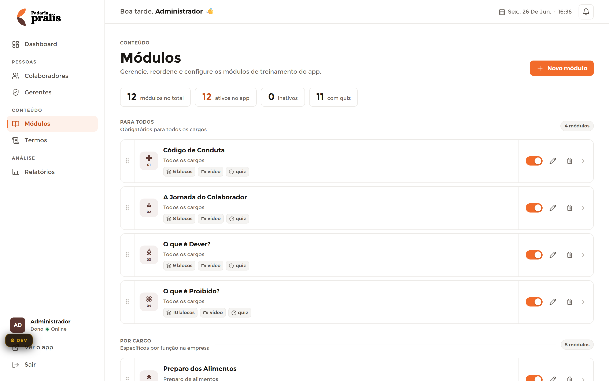

# Módulos — Admin

**Mundo:** ☀️ Admin (CMS) · **Rota:** `/admin/modulos`

## Objetivo
Gerenciar, reordenar e configurar os módulos de treinamento do app — ligar/desligar no app, ver blocos/tipo/quiz e abrir o editor.

## Hierarquia visual
1. **AdminPageHeader** (eyebrow `CONTEÚDO` + h1 "Módulos" + subtítulo) com a ação accent **"+ Novo módulo"**.
2. **Fileira de StatCards/contadores** (12 no total · 12 ativos · 0 inativos · 11 com quiz).
3. **Lista agrupada de módulos** em grupos rotulados ("PARA TODOS — Obrigatórios para todos os cargos · 4 módulos"; "POR CARGO — Específicos · 5 módulos"). Cada linha: handle de arrastar, ModuleIcon, título, subtítulo (cargos), meta-chips (`6 blocos`, `vídeo`, `quiz`), toggle de visibilidade, ações editar/excluir e chevron.

## Fluxo do usuário
Entra → lê os contadores no topo → varre os grupos → arrasta para reordenar, alterna o toggle "ativo no app", clica no lápis (ou na linha) para abrir o editor, ou "+ Novo módulo".

## Componentes utilizados
`AdminLayout`, `AdminSidebar`, `AdminTopbar`, `AdminPageHeader` (+1 ação accent), `StatCard` (contadores 12/12/0/11), grupos com rótulo eyebrow + badge contagem, linha de módulo (handle drag, `ModuleIcon`, meta-chips/badges, **toggle** ativo, ações editar/excluir no hover, chevron), `SectionCard`.

## Tokens / identidade
`color.admin.accent` no "+ Novo módulo" e no estado ativo do toggle; rótulos de grupo `typography.scaleAdmin.eyebrow`; chips/badges `radius.pill`; reordenação com `motion.spring.default`; cards/linhas com borda `color.admin.border`. `ModuleIcon` (ícones de padaria) aqui é identidade do módulo, monocromático no admin. Sem dourado.

