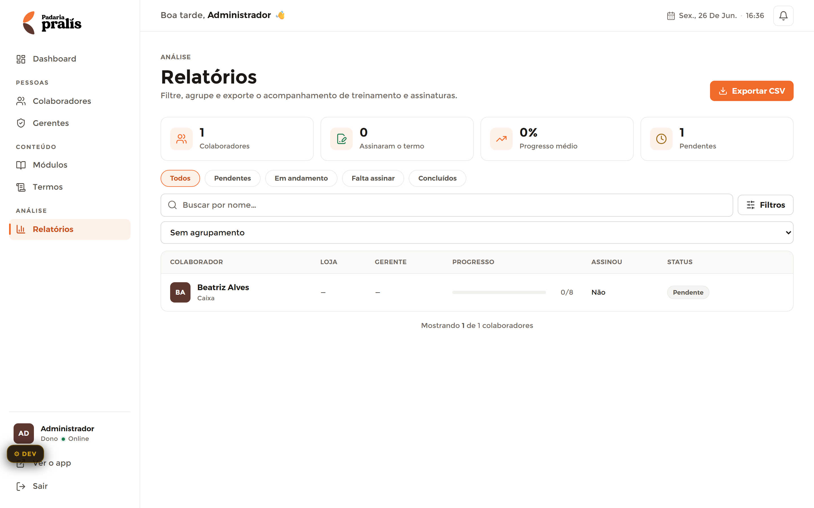

# Relatórios — Admin

**Mundo:** ☀️ Admin (CMS) · **Rota:** `/admin/relatorios`

## Objetivo
Filtrar, agrupar e exportar o acompanhamento de treinamento e assinaturas de toda a base de colaboradores.

## Hierarquia visual
1. **AdminPageHeader** (eyebrow `ANÁLISE` + h1 "Relatórios" + subtítulo) com a ação accent **"⤓ Exportar CSV"**.
2. **Fileira de 4 StatCards** (1 Colaboradores · 0 Assinaram o termo · 0% Progresso médio · 1 Pendentes).
3. **Barra de filtros**: chips de status (Todos/Pendentes/Em andamento/Falta assinar/Concluídos), busca, botão "Filtros", e dropdown "Sem agrupamento".
4. **Tabela** (COLABORADOR · LOJA · GERENTE · PROGRESSO · ASSINOU · STATUS) com linha Beatriz Alves (0/8, "Não", "Pendente") e rodapé "Mostrando 1 de 1 colaboradores".

## Fluxo do usuário
Entra → escolhe chip de status / busca / agrupa → varre a tabela filtrada → exporta CSV para relatório externo.

## Componentes utilizados
`AdminLayout`, `AdminSidebar`, `AdminTopbar`, `AdminPageHeader` (+1 ação accent "Exportar CSV"), `StatCard` (×4), chips de filtro (segmented), campo de busca, botão "Filtros", dropdown de agrupamento, **tabela herói** (header eyebrow), `Avatar`, barra de progresso, `StatusBadge` ("Pendente"), `EmptyState`, contador de resultados.

## Tokens / identidade
`color.admin.accent` em "Exportar CSV" e no chip de filtro ativo (1 accent/tela); KPIs `typography.scaleAdmin.kpi` tabular com count-up; chips e badges `radius.pill`; tabela com `color.admin.border`; status cor+ícone+texto. Sem dourado.

