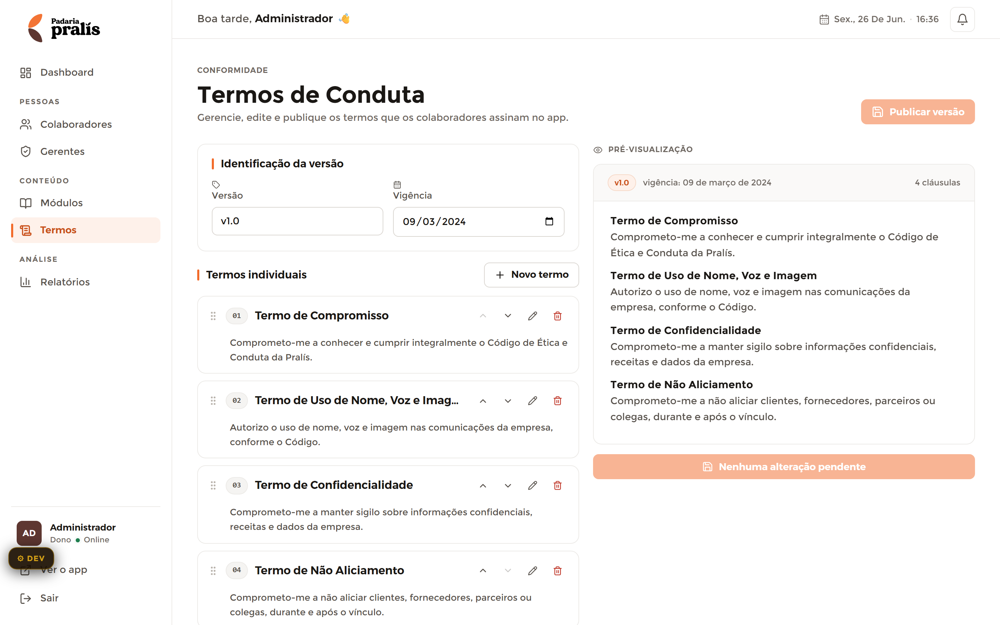

# Termos de Conduta — Admin

**Mundo:** ☀️ Admin (CMS) · **Rota:** `/admin/termos`

## Objetivo
Gerenciar, editar e publicar os termos que os colaboradores assinam no app — com versionamento e pré-visualização do que será assinado.

## Hierarquia visual
1. **AdminPageHeader** (eyebrow `CONFORMIDADE` + h1 "Termos de Conduta" + subtítulo) com a ação **"Publicar versão"** à direita.
2. **Editor (coluna esquerda)**: card "Identificação da versão" (Versão `v1.0`, Vigência `09/03/2024`), seção "Termos individuais" com ação "+ Novo termo" e a lista de termos editáveis (Compromisso, Uso de Nome/Voz/Imagem, Confidencialidade, Não Aliciamento) — cada um com handle de arrastar, título, trecho e ações editar/excluir.
3. **Pré-visualização (coluna direita)**: cartão "v1.0 · vigência 09 mar 2024 · 4 cláusulas" listando os termos como o colaborador verá, com rodapé "Reforçar alteração pendente".

## Fluxo do usuário
Entra → ajusta versão/vigência → adiciona/reordena/edita termos individuais → confere a pré-visualização à direita → "Publicar versão" para liberar a assinatura no app.

## Componentes utilizados
`AdminLayout`, `AdminSidebar`, `AdminTopbar`, `AdminPageHeader` (+ ação "Publicar versão"), `SectionCard` (Identificação / Termos individuais / Pré-visualização), inputs de versão e vigência (date), lista de termos arrastáveis (handle, ações editar/excluir), badge de versão "v1.0", contagem de cláusulas, botão "Reforçar alteração pendente".

## Tokens / identidade
1 accent `color.admin.accent` na ação de publicar; SectionCards com borda `color.admin.border`, `radius.lg`; inputs `radius.md`; reordenação com `motion.spring.default`; badge de versão `radius.pill`. Estado "alteração pendente" sinaliza dirty/rascunho. Sem dourado.

