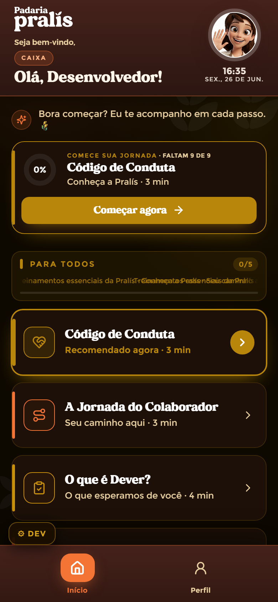

# Home / Feed — Colaborador (Trilha Viva)

**Mundo:** 🌙 App (colaborador) · **Rota:** `/feed`

## Objetivo
Receber o colaborador, mostrar onde ele parou e o próximo passo — a "Trilha Viva" com um herói "Continuar/Começar" que tira a fricção de retomar.

## Hierarquia visual
1. **Header de boas-vindas**: logo "Padaria Pralís", "Seja bem-vindo", saudação grande **"Olá, Desenvolvedor!"** e o `LisHeaderAvatar` (Lis com ring de progresso) + data/hora e pill de cargo "CAIXA". A frase da Lis "Bora começar? Eu te acompanho em cada passo." dá o tom.
2. **Card herói "Continuar/Começar"**: bloco dourado em destaque — "COMECE SUA JORNADA · FALTAM 9 DE 9", "0% · Código de Conduta · Conheça a Pralís · 3 min" e o CTA **"Começar agora"**. É o elemento que mais salta.
3. **Lista da trilha "PARA TODOS"** (ring de progresso 0/5): ModuleCards empilhados — "Código de Conduta · Recomendado agora · 3 min" (ativo, em destaque), "A Jornada do Colaborador · Seu caminho aqui", "O que é Dever?" etc. Ao rodapé, `BottomNav` com **Início** (ativo) e **Perfil**.

## Fluxo do usuário
Abre o app → vê a saudação e onde parou → toca "Começar agora" no herói (ou num ModuleCard recomendado) → entra no StoryPlayer → volta e a trilha reflete o avanço.

## Componentes utilizados
`SproutLogo`, `LisHeaderAvatar` (ring de progresso), `LisCard`/fala da Lis, **card herói "Continuar"** (com `ModuleIcon`, progresso e CTA), `ModuleCard` (estados active/in-progress/locked, highlight "Recomendado agora"), `StoryProgressBar`/ring de seção, `BottomNav` (Início/Perfil, pílula `layoutId="nav-pill"`), `AnimatedBackground`.

## Tokens / identidade
Fundo quente `color.appDark.bgBase` (nunca preto puro); ação `color.appDark.action` (laranja) no CTA e no card ativo; **dourado** `color.appDark.gold` no card herói e nos rings (brilho/celebração); texto creme `color.appDark.textSecondary`. Motion com `motion.spring.navPill` na BottomNav, `motion.easing.emphasized` nas entradas; sem `repeat:Infinity`, sem blur.

