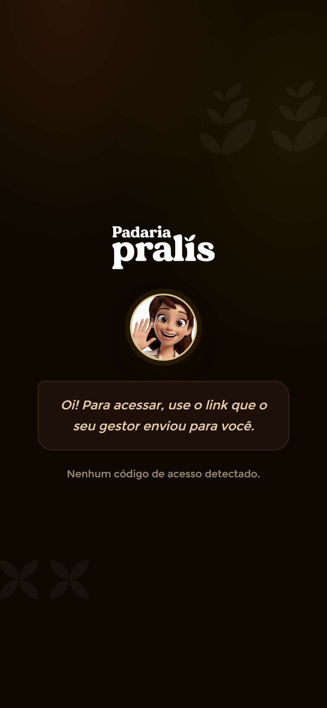

# Login — Colaborador (acesso por link)

**Mundo:** 🌙 App (colaborador) · **Rota:** `/` (entrada / gate de acesso)

## Objetivo
Acolher o colaborador que chega sem link válido e orientá-lo — o acesso é por link enviado pelo gestor, não por formulário de senha.

## Hierarquia visual
1. **Marca centralizada**: logo "Padaria Pralís" sobre fundo escuro quente com folhas-marca sutis ao fundo (canto superior e inferior).
2. **LisAvatar** (acenando, com ring dourado) logo abaixo — presença calorosa da guia.
3. **LisCard de orientação**: "Oi! Para acessar, use o link que o seu gestor enviou para você." E, em texto mudo abaixo, o estado: "Nenhum código de acesso detectado."

## Fluxo do usuário
Abre o app sem código → vê a marca + Lis + instrução → busca o link enviado pelo gestor → ao abrir o link com código válido, entra direto no feed (a tela em si não tem formulário de senha).

## Componentes utilizados
`SproutLogo`/logotipo da marca, `AnimatedBackground` (folhas-marca sutis, theme-aware), `LisAvatar` (estado happy/encouraging, acenando, ring dourado), `LisCard` (mensagem de orientação), texto de estado (sem código detectado), `ErrorBoundary` na raiz.

## Tokens / identidade
Fundo escuro quente `color.appDark.bgBase`/`bgDeep` (nunca preto puro); ring da Lis em `color.appDark.gold` (brilho); LisCard `color.appDark.surfaceCard` + `radius.card`; texto creme `color.appDark.textSecondary` e muted `color.appDark.textMuted` no estado. Motion sutil sem `repeat:Infinity` nem blur; respeita reduced-motion.

