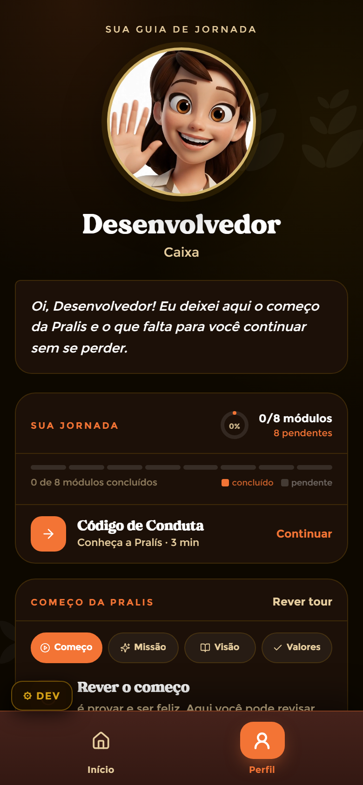

# Perfil — Colaborador (Sua Guia de Jornada)

**Mundo:** 🌙 App (colaborador) · **Rota:** `/perfil`

## Objetivo
Ser a "casa" do colaborador: identidade, onde parou e atalhos para retomar e rever o tour da Pralís, com a Lis como guia presente.

## Hierarquia visual
1. **Cabeçalho de identidade**: eyebrow "SUA GUIA DE JORNADA", `LisAvatar` grande (estado happy, acenando) e o nome **"Desenvolvedor"** + cargo "Caixa".
2. **Fala da Lis** (LisCard): "Oi, Desenvolvedor! Eu deixei aqui o começo da Pralís e o que falta para você continuar sem se perder."
3. **Bloco "SUA JORNADA"**: ring "0% · 0/8 módulos · 8 pendentes" + atalho "Código de Conduta · Conheça a Pralís · 3 min · **Continuar**". Abaixo, **"COMEÇA DA PRALÍS · Rever tour"** com chips/segmented (Começo/Missão/Visão/Valores) e o card "Rever o começo". `BottomNav` ao rodapé (Perfil ativo).

## Fluxo do usuário
Abre Perfil → vê quem é e onde parou → toca "Continuar" para voltar ao módulo atual, ou navega pelos chips do tour (Começo/Missão/Visão/Valores) para rever a história da Pralís.

## Componentes utilizados
`LisAvatar` (happy), `LisCard` (fala), card "SUA JORNADA" (ring de progresso + atalho "Continuar"), `ModuleCard`/linha de continuar, segmented/chips do tour ("COMEÇA DA PRALÍS"), `ValuesCard`/`SummaryCard` no rever-tour, `BottomNav` (Perfil ativo), `AnimatedBackground`. (`ThemeToggle` mora aqui, opcional.)

## Tokens / identidade
Fundo `color.appDark.bgBase`; ação "Continuar" e chip ativo em `color.appDark.action`; ring/realces em `color.appDark.gold`; texto creme `color.appDark.textSecondary`. Narração da Lis com `motion.stagger.appNarrative` (respeita reduced-motion); pílula da nav `motion.spring.navPill`. Sem blur, sem loop infinito.

