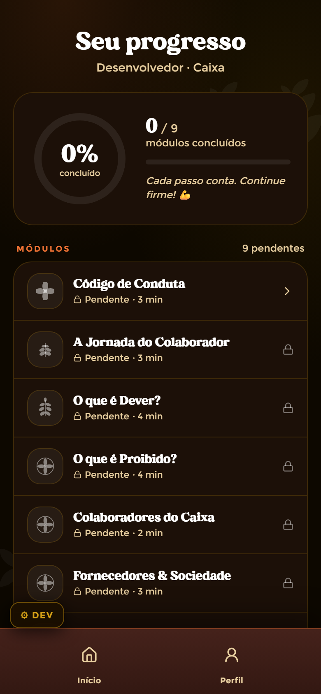

# Progresso — Colaborador

**Mundo:** 🌙 App (colaborador) · **Rota:** `/perfil` → aba/seção "Seu progresso" (lista de módulos)

## Objetivo
Mostrar o avanço geral e a lista completa de módulos com seus estados — uma visão de quanto falta, com encorajamento da Lis.

## Hierarquia visual
1. **Título "Seu progresso"** + subtítulo "Desenvolvedor · Caixa".
2. **Card-resumo de avanço**: anel/contador **"0% concluído"** + "0/9 módulos concluídos" e a frase de incentivo "Cada passo conta. Continue firme! 💪".
3. **Lista "MÓDULOS" (9 pendentes)**: ModuleCards empilhados com ModuleIcon, título, estado "Pendente · 3 min" e ícone de cadeado nos bloqueados (Código de Conduta, A Jornada do Colaborador, O que é Dever?, O que é Proibido?, Colaboradores do Caixa, Fornecedores & Sociedade…). `BottomNav` ao rodapé (Início / Perfil ativo).

## Fluxo do usuário
Abre Perfil/Progresso → lê o percentual e quantos faltam → varre a lista → toca num módulo desbloqueado para retomar no StoryPlayer (os bloqueados mostram cadeado até `prevDone`).

## Componentes utilizados
Card-resumo de progresso (anel/percentual + contagem + frase da Lis), `ModuleCard` (estados `locked`/`active`/`in-progress`/`done`, com cadeado quando bloqueado), `ModuleIcon`, `StoryProgressBar`/ring, `BottomNav` (Perfil ativo), `AnimatedBackground`.

## Tokens / identidade
Fundo `color.appDark.bgBase`; anel/percentual usa `color.appDark.gold`/`.action`; módulos bloqueados em `color.appDark.textLocked`; texto creme. Desbloqueio segue o **contrato congelado `prevDone`**. Motion: entradas com `motion.easing.emphasized`, ring com `motion.durations.progressDraw`; sem `repeat:Infinity`.

