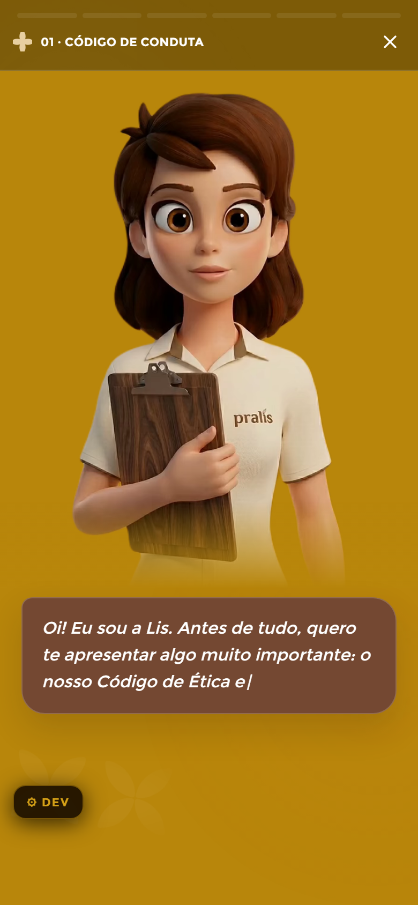

# StoryPlayer — Módulo (Colaborador)

**Mundo:** 🌙 App (colaborador) · **Rota:** `/modulo/:id` (StoryPlayer fullscreen)

## Objetivo
Entregar o conteúdo do módulo como uma sequência de "stories" fullscreen, narrados pela Lis — leitura imersiva, um bloco por vez.

## Hierarquia visual
1. **Barra de progresso segmentada** no topo (`StoryProgressBar`: ouro=feito, laranja=atual) + cabeçalho mínimo "✚ 01 · CÓDIGO DE CONDUTA" e botão fechar "✕".
2. **Lis em cena** — ilustração grande da mascote (segurando uma prancheta "pralis"), ocupando o centro/topo do quadro; é o foco emocional.
3. **LisCard de fala** (caixa marrom translúcida na base) com a narração em typewriter: "Oi! Eu sou a Lis. Antes de tudo, quero te apresentar algo muito importante: o nosso Código de Ética e…". Toque/seta/swipe avança.

## Fluxo do usuário
Entra do feed → lê/ouve o story atual → toca à direita, usa seta ou faz swipe para avançar (esquerda volta) → ao fim do módulo, vê a conclusão/celebração e o progresso é gravado → "✕" sai para o feed.

## Componentes utilizados
`StoryPlayer` (shell fullscreen: progresso, setas, swipe drag-x, teclado, auto-advance), `StoryProgressBar`, `LisAvatar` (estado encouraging/idle, Rive→PNG), `LisCard` (typewriter), `TextCard`/`VideoCard`/`QuizCard`/`PollCard`/`SummaryCard` conforme o `type` da Story, `CompletionCard` no fim, `TopicIllustration`.

## Tokens / identidade
Fundo escuro do mundo (aqui o quadro do story usa tom quente/mostarda da cena); `color.appDark.action` na barra atual, `color.appDark.gold` nos segmentos concluídos; texto creme `color.appDark.textSecondary`. Narração com `motion.stagger.appNarrative` (respeita `reducedMotion` mostrando texto inteiro); avanço com `motion.spring.default`/`motion.durations.panel`. Fullscreen: **sem BottomNav**. Acessibilidade: setas/teclado (`accessibility.focus`).

