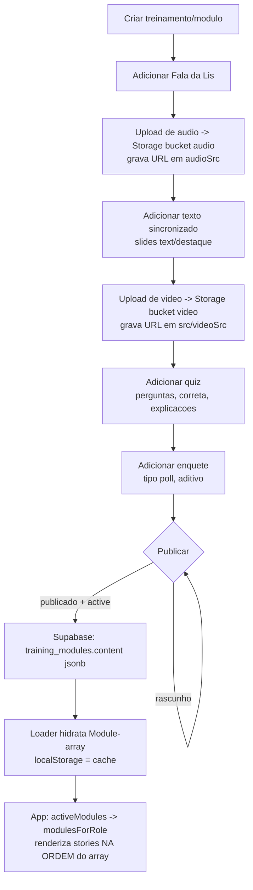

# Dashboard de Conteúdo — Fluxo Atual e Visão-Alvo

> **O que é este documento.** Um mapa de como a autoria de conteúdo do Pralis Conduta
> funciona **hoje** pelo dashboard administrativo, e de como ela deve **evoluir** para virar
> o centro de controle de toda a plataforma — sem quebrar o contrato `Module`/`Story` nem a
> experiência do colaborador.
>
> **Audiência.** Marco e quem for planejar/aprovar a evolução do admin. Os trechos
> técnicos (nomes de campo, chaves, arquivos) ficam em inglês/exato; a narrativa em PT-BR.
>
> **Aviso de escopo.** As seções 2 a 6 descrevem **propostas**. Nada aqui deve ser
> implementado antes de aprovação explícita. A seção 1 descreve apenas o que já existe e
> está verificado no código.

---

## 1. Estado ATUAL da autoria

Hoje **toda** a autoria de conteúdo vive em `localStorage`, sob a chave
`pralis_admin_data`, gerenciada por um store externo singleton com `useSyncExternalStore`.

- Store: `src/lib/adminStore.ts:20` (`ADMIN_DATA_KEY = 'pralis_admin_data'`),
  hook reativo `useAdminStore` em `src/lib/adminStore.ts:146`.
- Persistência: `persist()` grava no `localStorage` e notifica os listeners —
  `src/lib/adminStore.ts:94`.
- O app do colaborador lê **os mesmos dados** desse store (ver comentário em
  `src/lib/adminStore.ts:8`).

### 1.1 O que DÁ pra fazer hoje pelo dashboard

| Recurso | O que dá pra fazer | Onde (file:line) |
|---|---|---|
| **Módulos — CRUD** | Criar, editar, excluir, ativar/desativar | `AdminModulos.tsx:219` (criar), `adminStore.ts:153` (`saveModule`), `adminStore.ts:164` (`deleteModule`), `adminStore.ts:169` (`toggleActive`) |
| **Módulos — reordenar** | Drag & drop por seção (`geral`/`cargo`/`final`) via Framer `Reorder.Group` | `AdminModulos.tsx:297` + `adminStore.ts:180` (`reorderModules`) |
| **Módulo — identidade** | Título, subtítulo, etiqueta, tempo estimado, cor, símbolo/ícone | `AdminModuloEditor.tsx:290`–`431` |
| **Módulo — público** | Definir cargos (`all` ou lista de `Role`) | `AdminModuloEditor.tsx:438`–`472` (`toggleRole` em `:200`) |
| **Módulo — visibilidade** | Switch ativo/inativo (`active`) | `AdminModuloEditor.tsx:475`–`506` |
| **Módulo — seção no app** | `geral` · `cargo` · `final` | `AdminModuloEditor.tsx:509`–`542` |
| **Slides — texto** | Etiqueta, título, parágrafos | `SlideEditor.tsx:102`–`132` |
| **Slides — destaque** | Igual texto + frase em destaque (`highlight`) | `SlideEditor.tsx:134`–`175` |
| **Slides — Fala da Lis** | Texto que a Lis narra (`type: 'lis'`) | `SlideEditor.tsx:177`–`198` |
| **Slides — reordenar** | Drag & drop dos slides via `Reorder.Group` (ou setas ↑/↓) | `AdminModuloEditor.tsx:570` (reorder) e `SlideEditor.tsx:46`–`64` (setas) |
| **Vídeo** | Adicionar/remover vídeo da Lis, título, duração, posição (antes/depois dos slides); arquivo via drag & drop que grava `src: /videos/<arquivo>` | `AdminModuloEditor.tsx:692`–`768`; upload em `:809` (`VideoUpload`) |
| **Quiz** | Banco de perguntas, alternativas, marcar correta (`correctIndex`), explicação geral e por alternativa, `sampleSize` e `randomize` | `QuizEditor.tsx` (config em `:36`, perguntas em `:111`) |
| **Termos** | CRUD de cláusulas (HTML serializado `<h3>/<p>`), reordenar, `termsVersion`, `termsEffectiveDate`, publicar | `AdminTermos.tsx` (parse/serialize em `:20`/`:30`, publicar em `:231`) |
| **Splash / tela inicial** | `welcomeText`, `mission`, `vision`, `values` | `adminStore.ts:191` (`setSplash`); editor em `AdminInicio` |

**Criar um módulo (caminho real):** `AdminModulos.tsx:219` chama
`makeBlankModule(mods.length + 1)` (`src/admin/lib/modules.ts:5`), que gera
`id = modulo-${Date.now().toString(36)}` + 2 stories default (uma `lis`, uma `text`);
`saveModule()` adiciona ao store (`adminStore.ts:153`) e o editor abre em
`/admin/modulos/:id`.

### 1.2 O que NÃO dá pra fazer hoje (limitações)

| Limitação | Detalhe verificado | Onde se vê |
|---|---|---|
| **Sem upload real de vídeo** | O drag & drop só lê `file.name` e monta `src: /videos/<arquivo>`; o arquivo precisa ser **copiado manualmente** para `/public/videos/` | `AdminModuloEditor.tsx:818` (`onFile(file.name)`), aviso em `:885` |
| **Sem upload de áudio** | Não existe campo de upload de áudio no admin; `audioSrc` é preenchido manualmente apontando para `/public` | (ausência no editor; gerenciado fora da UI) |
| **Sem enquete** | Não existe tipo `poll`/enquete nem editor para ele | (ausência em `AdminModuloEditor.tsx` `TABS` `:38`) |
| **Sem anexos** | Não há upload/gestão de arquivos anexos | (ausência) |
| **Sem versionamento de módulos** | Não há rascunho vs publicado, histórico ou agendamento para módulos; salvar é imediato e definitivo | `adminStore.ts:153` (sobrescreve direto) |
| **Sem soft-delete** | `deleteModule` remove de vez; o `confirm()` avisa "não pode ser desfeita" | `AdminModulos.tsx:225`, `adminStore.ts:164` |
| **Conteúdo preso em 1 navegador** | Tudo vive no `localStorage` daquele navegador/máquina; outro dispositivo não enxerga | `adminStore.ts:20`, `:94` |
| **Sem realtime entre abas** | Só sincroniza via evento `storage` do navegador (mesma origem, outra aba); **não** entre dispositivos | `adminStore.ts:112`–`119` |

> **Termos já têm um esboço de versionamento.** `termsVersion` + `termsEffectiveDate` +
> o fluxo "Publicar versão" existem, e o aviso deixa claro que **assinaturas anteriores
> ficam vinculadas à versão antiga** (`AdminTermos.tsx:380`–`388`, `:483`). Isso é a
> referência de comportamento para o versionamento proposto na seção 5.

---

## 2. VISÃO-ALVO: o Dashboard como centro de controle

A meta é o dashboard ser o **único lugar** onde se opera a plataforma: conteúdo, mídia,
conformidade, pessoas e dados. O conteúdo deixa de morar no navegador e passa a viver no
Supabase, com a mídia no Storage. **O app do colaborador não muda** (decisão D2).

### 2.1 Hierarquia de navegação proposta

```
Dashboard (admin)
├── Treinamentos
│   └── Módulo (editor)
│       ├── Informações      (identidade, cargos, seção, visibilidade)   ← já existe
│       ├── Stories / Slides (texto · destaque · Fala da Lis)             ← já existe
│       ├── Lis               (falas, áudio/cues, gravações)              ← evoluir (P2)
│       ├── Mídia             (áudio + vídeo, upload → Storage)           ← evoluir (P1)
│       ├── Quiz              (perguntas, correta, explicações)           ← já existe
│       ├── Enquete           (tipo 'poll', aditivo)                      ← novo (P2, D7)
│       └── Publicar          (rascunho → publicado, versão)             ← novo (P2)
├── Termos                    (cláusulas + versão + vigência)            ← já existe
├── Avisos                    (mensagens + push)                          ← novo (P3)
├── Colaboradores             (pessoas, cargos, assinaturas)             ← já existe (parcial)
└── Relatórios                (analytics de progresso/quiz)              ← novo (P4)
```

### 2.2 Princípios que NÃO mudam (decisão D1)

- O contrato `Module`/`Story` (`src/lib/types.ts`) permanece a fonte única de verdade do
  conteúdo. A evolução é só de **autoria, storage, mídia e telas do admin**.
- O app continua consumindo via `content.ts` → `activeModules()` → `modulesForRole()`,
  filtrando `active !== false` e renderizando stories **na ordem do array**.

---

## 3. FLUXO COMPLETO DE CRIAÇÃO DE CONTEÚDO (proposto)

> Passo a passo do estado-alvo. **Não implementar ainda.**

1. **Criar treinamento/módulo.** Botão "Novo módulo" gera um `Module` em branco
   (hoje `makeBlankModule`, `modules.ts:5`) e abre o editor. No alvo, isso grava um
   **rascunho** em `training_modules` no Supabase (D2).
2. **Adicionar Fala da Lis.** Story `type: 'lis'` com o texto que a Lis narra
   (hoje em `SlideEditor.tsx:177`).
3. **Adicionar áudio (upload → Storage).** Upload drag & drop no admin envia o arquivo
   para o bucket `audio` do Supabase Storage e grava a **URL** em `audioSrc` (D3).
   *(Hoje não existe upload de áudio — ver 1.2.)*
4. **Adicionar texto sincronizado.** Slides `text`/`destaque` na ordem desejada, alinhados
   com a fala/áudio da Lis (hoje em `SlideEditor.tsx:102`).
5. **Adicionar vídeo (upload → Storage).** Upload drag & drop envia ao bucket `video` e
   grava a URL em `src`/`videoSrc` (D3). *(Hoje o upload só lê o nome do arquivo —
   `AdminModuloEditor.tsx:818`.)*
6. **Adicionar quiz.** Banco de perguntas, alternativa correta, explicações, `sampleSize`,
   `randomize` (hoje em `QuizEditor.tsx`).
7. **Adicionar enquete.** Novo tipo `poll`, **opcional e aditivo**, com editor próprio no
   admin (D7). *(Não existe hoje.)*
8. **Publicar.** Passar de rascunho para publicado; o app só enxerga o que está publicado e
   `active` (seção 5).
9. **Consumir no app.** O loader hidrata `Module[]` do Supabase (com `localStorage` como
   cache), e o app renderiza igual a hoje (D2) — sem alteração de código no app.

### 3.1 Diagrama do fluxo



---

## 4. ORDENAÇÃO via Drag & Drop (decisão D6)

### 4.1 Onde o drag & drop JÁ existe

| Entidade | Mecanismo | file:line |
|---|---|---|
| **Módulos** | `Reorder.Group` por seção → `reorderModules(orderedIds)` | `AdminModulos.tsx:297`, `adminStore.ts:180` |
| **Slides** | `Reorder.Group` no editor (slide expandido não vira `Reorder.Item` para não quebrar foco) + setas ↑/↓ | `AdminModuloEditor.tsx:570`, `SlideEditor.tsx:46` |
| **Termos** | `Reorder.Group` de cláusulas + setas ↑/↓ | `AdminTermos.tsx:357`, `moveUp/moveDown` em `:250`/`:260` |

### 4.2 Onde ESTENDER (proposto)

- **Perguntas de quiz.** Hoje só dá pra adicionar/excluir/editar (`QuizEditor.tsx:111`); a
  reordenação por drag & drop ainda **não existe** — estender com `Reorder.Group` (D6).
- **Falas da Lis.** Quando as falas/áudios da Lis virarem itens próprios (P2), aplicar o
  mesmo padrão de drag & drop.

### 4.3 Garantia: "ordem no dashboard === ordem no app"

A ordem do dashboard é a ordem no app **porque o app lê os arrays na ordem em que estão
gravados**, sem reordenar:

- Módulos: o app filtra `active !== false` e renderiza na ordem do array de módulos.
- Stories: o app renderiza `module.stories` **na ordem do array** (mesma ordem que o
  `Reorder.Group` persiste em `setStories` → `saveModule`).

Portanto, reordenar no admin = reordenar no app, sem nenhum mapeamento extra.

### 4.4 Como fica com a coluna `order` no Supabase (D6)

No alvo, a posição de cada entidade ordenável (módulos, e por extensão perguntas/falas)
ganha uma coluna **`order`** explícita no Supabase, em vez de depender só da posição no
array JSON. O drag & drop grava o novo `order`; o loader ordena por `order` ao hidratar
`Module[]`. O resultado para o app é idêntico: a sequência continua sendo a ordem visível
no dashboard.

---

## 5. PUBLICAÇÃO E VERSIONAMENTO (proposto)

Estado-alvo para módulos (hoje **não existe** — salvar é imediato, ver 1.2):

| Conceito | Significado | Campo proposto |
|---|---|---|
| **Rascunho** | Editável, invisível para o colaborador | status `draft` |
| **Publicado** | Visível no app (se também `active`) | status `published` + `published_at` |
| **Versão** | Identifica a edição publicada | `version` |
| **Ativo** | Liga/desliga sem despublicar (já existe) | `active` (`adminStore.ts:169`) |

Fluxo proposto: editar em **rascunho** → revisar no preview → **Publicar** (grava `version`
+ `published_at`, status `published`) → app passa a enxergar a nova versão.

> **Precedente já no código (termos).** O fluxo "Publicar versão" dos termos já implementa
> essa ideia: `termsVersion` + `termsEffectiveDate`, modal de confirmação e o aviso de que
> **assinaturas anteriores permanecem vinculadas à versão antiga** — nova versão vale só
> para assinaturas futuras (`AdminTermos.tsx:380`–`388` e `:483`). O versionamento de
> módulos deve seguir o mesmo princípio de **imutabilidade do que já foi consumido**.

---

## 6. MÓDULO DE TESTE end-to-end (proposto)

> **Objetivo.** Roteiro para, **depois de aprovado**, criar UM módulo completo usando a
> arquitetura recomendada (Supabase + Storage) e validá-lo no app de ponta a ponta.
>
> **Não implementar ainda — primeiro aprovar.**

**No dashboard (admin):**

1. **Treinamentos → Novo módulo.** Preencher Informações: título, subtítulo, etiqueta,
   tempo, cor, símbolo, cargos (`all` ou lista), seção (`geral`/`cargo`/`final`),
   visibilidade `ativo`.
2. **Stories.** Adicionar, nesta ordem: 1 **Fala da Lis** (intro), 2 slides de **Texto**,
   1 **Destaque**. Reordenar por drag & drop para fixar a sequência.
3. **Mídia → Áudio.** Fazer upload de um áudio da Lis; confirmar que o admin gravou a
   **URL do Storage** em `audioSrc` (não um caminho `/public`).
4. **Mídia → Vídeo.** Fazer upload de um vídeo; confirmar a **URL do Storage** em
   `src`/`videoSrc`; escolher posição (antes/depois dos slides).
5. **Quiz.** Criar 3 perguntas, marcar a correta de cada, preencher explicações, definir
   `sampleSize = 2` e `randomize` ligado.
6. **Enquete.** Adicionar 1 enquete (`poll`) com 2–3 opções (valida o tipo aditivo, D7).
7. **Publicar.** Confirmar a publicação; conferir que `version`/`published_at` foram
   gravados e o status virou `published`.

**No app (colaborador) — verificação:**

8. Abrir o app com um colaborador de cargo compatível; confirmar que o módulo aparece
   (porque `active !== false` e está publicado).
9. Percorrer o módulo e validar que **a ordem dos stories é idêntica à do dashboard**
   (garantia da seção 4.3), que o áudio/vídeo tocam pelas URLs do Storage, e que o quiz
   sorteia `sampleSize` perguntas com `randomize`.
10. Concluir o módulo e checar que a conclusão é registrada igual aos módulos atuais
    (contrato preservado, D1).

**Critérios de aceite do teste:**

- Conteúdo veio do **Supabase**, não do `localStorage` daquele navegador.
- Mídia carregou via **URL do Storage**.
- **Ordem do dashboard === ordem no app**, sem ajustes manuais.
- App **não precisou de alteração de código** para consumir o módulo (D1/D2).

---

## Referências de código (single source of truth)

- Store/persistência: `src/lib/adminStore.ts`
- Listagem/criação/reorder de módulos: `src/admin/pages/AdminModulos.tsx`
- Editor de módulo (info, slides, vídeo, quiz): `src/admin/pages/AdminModuloEditor.tsx`
- Editor de slide: `src/admin/components/SlideEditor.tsx`
- Editor de quiz: `src/admin/components/QuizEditor.tsx`
- Termos (precedente de versionamento): `src/admin/pages/AdminTermos.tsx`
- Fábricas/ordenação de módulos e stories: `src/admin/lib/modules.ts`
- Contrato de tipos: `src/lib/types.ts`

> Decisões canônicas (D1, D2, D3, D6, D7, D10) referenciadas neste doc vivem na base de
> decisões do projeto; este documento as aplica, não as redefine.
