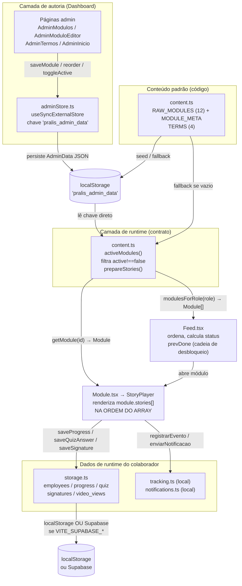
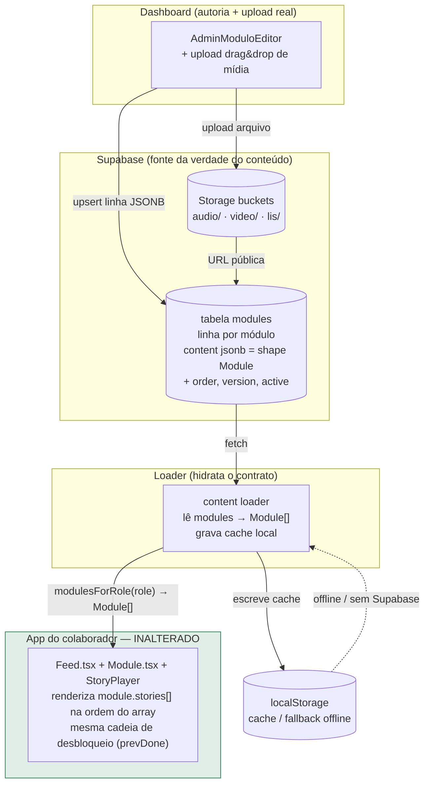

# Arquitetura da Plataforma de Treinamento — Pralis Conduta

> Documento de arquitetura geral (nível Staff/Principal). Descreve o **ecossistema atual**,
> o **contrato de preservação** entre a plataforma de autoria e o app do colaborador, e a
> **arquitetura-alvo** (conteúdo no Supabase como JSONB + mídia no Storage). É a fonte da
> verdade arquitetural; os demais documentos da evolução não devem contradizê-lo.
>
> **Idioma:** prosa em PT-BR; termos técnicos, nomes de tipos, chaves e arquivos em inglês.
> **Refs:** todas as referências de código usam `arquivo:linha` verificadas contra o repo.

---

## 1. Visão geral do ecossistema

O Pralis Conduta é uma plataforma de **treinamento e onboarding** (o "Código de Ética e
Conduta da Padaria Pralís") com duas grandes superfícies:

1. **O app do colaborador** — experiência tipo "stories" (Feed → StoryPlayer): vídeos da
   Lis, textos narrados com áudio, quizzes adaptativos, assinatura de termos. É a parte que
   o colaborador vê e que **converte** o treinamento em conhecimento e assinatura.
2. **A plataforma de autoria + gestão (Admin/Dashboard)** — onde o gestor cria/edita
   módulos, reordena conteúdo, edita termos e a tela inicial, e acompanha o progresso dos
   colaboradores.

**Stack:** React 18 + Vite + TypeScript + Tailwind + Framer Motion + React Router, empacotado
como **PWA** (`vite-plugin-pwa`). Hoje o sistema é **localStorage-first**: roda 100% no
navegador, com **Supabase opcional** (ativado por `VITE_SUPABASE_*`) para entidades de
runtime do colaborador.

### Princípios que regem toda a evolução

- **Evoluir sem reconstruir.** A experiência do colaborador está madura e validada. A
  evolução acontece *ao redor* dela (autoria, storage de conteúdo, hospedagem de mídia, UX
  do admin), **nunca refazendo o app**.
- **O Dashboard como centro de controle.** O gestor edita uma vez e o app do colaborador
  reflete o mesmo conteúdo — porque ambos leem da mesma fonte (`modulesForRole` lê o que o
  admin salvou; ver §2). A meta é levar essa fonte de localStorage → Supabase **sem mudar o
  contrato** que o app consome.
- **Retrocompatibilidade obrigatória.** Cada fase preserva o shape `Module`/`Story` e o
  comportamento do colaborador. localStorage permanece como cache/fallback offline.
- **Uma fonte da verdade por entidade.** Conteúdo (módulos/termos/splash) tem um dono;
  progresso/quizzes/assinaturas têm outro. Eles **não** se misturam (ver `adminStore.ts:11-14`).

---

## 2. Mapa da arquitetura ATUAL

A arquitetura atual se organiza em **cinco camadas**, do conteúdo editável até o tracking.

### 2.1 Camadas

| Camada | O que faz | Onde vive |
| --- | --- | --- |
| **Conteúdo / autoria** | Seed dos 12 módulos + termos + splash; edição pelo gestor; persistência editável | `content.ts`, `adminStore.ts`, páginas `admin/pages/*` |
| **Runtime / contrato** | Resolve o conteúdo ativo para um cargo e o entrega como `Module[]`/`Module` | `content.ts` (`modulesForRole`, `getModule`, `activeModules`) |
| **App colaborador** | Renderiza o feed e o player de stories na ordem do array | `app/pages/Feed.tsx`, `app/pages/Module.tsx`, `app/components/StoryPlayer.tsx` |
| **Dados / progresso** | Persiste employees, progress, quiz, signatures, video views | `storage.ts` (localStorage ⇄ Supabase opcional) |
| **Tracking / Notificações** | Eventos do colaborador + avisos para dono/gerente | `tracking.ts`, `notifications.ts` (só local hoje) |

### 2.2 Diagrama de fluxo de dados (plataforma → app)

**Leitura do diagrama:** o conteúdo nasce no código (`RAW_MODULES`), pode ser editado no
admin (que persiste em `pralis_admin_data`), e é **resolvido** por `activeModules()` em
`content.ts`. O app **nunca** conhece a origem: ele só recebe `Module[]`/`Module`. Os dados
de *progresso* do colaborador seguem por uma camada separada (`storage.ts`), que já é
localStorage **ou** Supabase de forma transparente.

### 2.3 Componentes × responsabilidade (refs `arquivo:linha`)

| Componente | Responsabilidade | Refs |
| --- | --- | --- |
| `RAW_MODULES` + `MODULE_META` | Seed dos 12 módulos (4 `geral`, 5 `cargo`, 3 `final`) e seus metadados visuais | `src/lib/content.ts:14`, `src/lib/content.ts:988` |
| `prepareStories()` | Injeta vídeo antes do quiz, define `sampleSize`/`randomize` e `reviewTarget` | `src/lib/content.ts:1011`, `src/lib/content.ts:1033` |
| `activeModules()` | Lê `pralis_admin_data`, filtra `active!==false`, cai para o default | `src/lib/content.ts:1126` |
| `modulesForRole(role)` | **Contrato de leitura:** módulos `'all'` + os do cargo → `Module[]` | `src/lib/content.ts:1148` |
| `getModule(id)` | **Contrato de leitura:** um módulo por id → `Module \| undefined` | `src/lib/content.ts:1155` |
| `TERMS` | Os 4 termos (compromisso, imagem, confidencialidade, não aliciamento) | `src/lib/content.ts:1064` |
| `useAdminStore()` | Store reativo (CRUD de módulos, reorder, toggle, termos, splash) | `src/lib/adminStore.ts:146` |
| `AdminData` | Shape persistido: `modules`, `termsText`, `termsVersion`, `termsEffectiveDate`, `splashConfig`, `lastUpdated` | `src/lib/adminStore.ts:29` |
| `reorderModules()` | Reordena a partir de uma lista de ids (drag&drop) | `src/lib/adminStore.ts:180` |
| `AdminModulos` | Lista e **reordena** módulos via Framer `Reorder` | `src/admin/pages/AdminModulos.tsx` |
| `AdminModuloEditor` | Edita info + slides (`Reorder`) + aba vídeo + aba quiz | `src/admin/pages/AdminModuloEditor.tsx:570`, `:809` |
| `AdminTermos` / `AdminInicio` | Edita HTML dos termos / configura splash (MVV) | `src/admin/pages/AdminTermos.tsx`, `AdminInicio.tsx` |
| `Feed.tsx` | Ordena, calcula `status`, aplica a **cadeia de desbloqueio** (`prevDone`) | `src/app/pages/Feed.tsx:130`, `:145`, `:151` |
| `Module.tsx` + `StoryPlayer` | Carrega `getModule(id)` e renderiza `module.stories[]` **na ordem do array** | `src/app/pages/Module.tsx:3`, `:50`, `:93` |
| `storage.ts` | Persistência de runtime (localStorage ⇄ Supabase) | `src/lib/storage.ts:18`, `:68`+ |
| `supabase.ts` | Cliente opcional; só instancia se houver `VITE_SUPABASE_*` | `src/lib/supabase.ts:11`, `:14` |
| `tracking.ts` | 5 tipos de evento + GPS best-effort, **só local** (`pralis:tracking:{id}`) | `src/lib/tracking.ts:10`, `:30`, `:63` |
| `notifications.ts` | 3 tipos de notificação, **local + console**, sem push real | `src/lib/notifications.ts:10`, `:28`, `:52` |

### 2.4 Cadeia de desbloqueio (regra de negócio do colaborador)

O Feed libera os módulos **em sequência**: um módulo só fica acionável quando todos os
anteriores estão concluídos. A regra é um *AND acumulado* (`prevDone`) em `Feed.tsx:133`,
`:145`, `:151`; o **dev mode** burla o bloqueio (`!prevDone && !devMode`, `Feed.tsx:145`).
Essa lógica é **parte do contrato do app** e não muda na evolução (ver §3 e §5).

### 2.5 Onde o conteúdo vive HOJE — atenção

> **O conteúdo é 100% localStorage.** Os módulos editados pelo gestor moram na chave
> `pralis_admin_data` (`adminStore.ts:20`), lida diretamente por `content.ts:1089`/`:1128`.
> **Nada de conteúdo está no Supabase hoje** — o Supabase opcional cobre apenas as entidades
> de runtime do colaborador (`employees`, `progress`, `quiz_answers`, `video_views`,
> `signatures`) via `storage.ts`. Mídia (vídeos da Lis, áudios MP3, `.webm`) é servida do
> `/public` (ex.: `videoSrc: '/lis-proibido.webm'`, `content.ts:1117`), e o "upload" no
> admin hoje apenas **instrui o gestor a copiar o arquivo manualmente** para
> `/public/videos/` (`AdminModuloEditor.tsx:844`, `:886`).

---

## 3. O contrato de preservação (D1)

### 3.1 Por que `Module`/`Story` é a "API" entre plataforma e app

O app do colaborador **não conhece** a origem do conteúdo. Ele consome apenas:

- `modulesForRole(role): Module[]` — `content.ts:1148`
- `getModule(id): Module | undefined` — `content.ts:1155`

e renderiza **`module.stories[]` na ordem exata do array** no `StoryPlayer`
(`Module.tsx:50`, `:93`). Tudo o que o app sabe é o **shape** `Module`/`Story`
(`types.ts:134-194`). Esse shape é, na prática, a **API interna** entre a plataforma de
autoria e o app: enquanto o loader entregar `Module[]` com esse formato, **o app funciona
sem alteração**, independentemente de o conteúdo vir do código, do localStorage ou do
Supabase.

### 3.2 O shape do contrato (resumo verificado)

**`Module`** (`types.ts:162-194`): `id`, `title`, `icon`, `color`, `estimatedMinutes`,
`mandatory`, `roles` (`'all' | Role[]`), `section` (`'geral' | 'cargo' | 'final'`),
`description`, `stories[]`, `number`, `gradient`, `accent`, `iconType`, `tag`, `subtitle`,
`kind?` (`'stories' | 'signature'`), `active?`.

**`Story`** — união de **6 tipos** (`types.ts:134-158`):

| `type` | Campos principais | Ref |
| --- | --- | --- |
| `lis` | `text`, `state?`, `videoSrc?` | `types.ts:135` |
| `text` | `title`, `tag`, `paragraphs[]`, `highlight?`, `highlights?`, `keywords?`, `audioSrc?`, `audioIncludesTitle?`, `narratorVideoSrc?` | `types.ts:136-147` |
| `video` | `videoId`, `title`, `description?`, `duration?`, `src?` | `types.ts:148-155` |
| `summary` | `title`, `bullets[]` | `types.ts:156` |
| `quiz` | `QuizConfig`: `intro?`, `questions[]`, `sampleSize?`, `randomize?` | `types.ts:119-132`, `:157` |
| `completion` | `badge`, `message` | `types.ts:158` |

> Não existe tipo `'poll'`/enquete hoje. Ele é **aditivo e futuro** (ver §5 / D7).

### 3.3 O que NUNCA pode mudar de forma incompatível

- O **shape** `Module`/`Story` e a união dos 6 tipos (`types.ts:134-194`). Campos podem ser
  **adicionados** (opcionais, aditivos); não podem ser removidos/renomeados/ter semântica
  trocada.
- As **assinaturas** `modulesForRole(role): Module[]` e `getModule(id): Module | undefined`
  (`content.ts:1148`, `:1155`) — são a fronteira de leitura do app.
- A regra de **ordem**: `module.stories[]` é renderizado na ordem do array (`Module.tsx`);
  a ordem dos módulos no dashboard é a ordem no app.
- A **cadeia de desbloqueio** (`prevDone`, `Feed.tsx:151`) e a lógica de status/progresso.
- O **shape** das entidades de runtime: `ModuleProgress`, `QuizAnswerRecord`,
  `SignatureRecord`, `VideoView` (`types.ts:48-76`) e a API de `storage.ts`.

Qualquer evolução que toque nesses pontos é, por definição, **fora de escopo** desta linha
de evolução (ver §5).

---

## 4. Arquitetura-ALVO (D2/D3)

O objetivo é mover a **fonte da verdade do conteúdo** de localStorage para o **Supabase**,
**sem o app perceber** — preservando integralmente o contrato da §3.

### 4.1 Conteúdo no Supabase como documentos JSONB (D2)

Cada módulo vira **uma linha** numa tabela `modules`, com o `Module` aninhado num campo
`jsonb`. **Não normalizamos** stories/quizzes em tabelas separadas: o app consome `Module`
aninhado, então JSONB é o **refactor mínimo** e mantém o contrato intacto.

Forma da linha (alvo):

| Coluna | Tipo | Papel |
| --- | --- | --- |
| `id` | text/uuid | id estável do módulo |
| `slug` | text | id legível (`'boas-vindas'`, etc.) |
| `section` | text | `'geral' \| 'cargo' \| 'final'` |
| `roles` | jsonb/text[] | `'all'` ou lista de cargos |
| `active` | boolean | mapeia `Module.active` (filtro `active!==false`) |
| `order` | integer | ordenação canônica (ver D6 / §4.4) |
| `version` | integer | versionamento/publish (fase 2) |
| `content` | jsonb | **o shape `Module` completo** (a "API") |
| `updated_at` | timestamptz | auditoria |
| `published_at` | timestamptz | publicação (fase 2) |

Um **loader** lê essas linhas e **hidrata o mesmo `Module[]`** que `modulesForRole`/
`getModule` já entregam hoje. O `localStorage` passa a ser **cache / fallback offline**
(não desaparece). É **retrocompatível**: se o Supabase não estiver configurado, o caminho
atual (`pralis_admin_data` → default) continua valendo.

### 4.2 Mídia no Supabase Storage (D3)

Vídeos, áudios e clipes da Lis migram para **buckets do Supabase Storage** (`audio/`,
`video/`, `lis/`). As **URLs públicas** são gravadas **nos campos que já existem** na
`Story` — `audioSrc`, `videoSrc` (em `lis`/`text`) e `src` (em `video`)
(`types.ts:135`, `:144`, `:154`). O admin ganha **upload real (drag&drop)** no lugar do
fluxo manual de copiar para `/public/videos/` (hoje em `AdminModuloEditor.tsx:844`, `:886`).
Como o app já lê desses campos, **nenhuma mudança no player** é necessária.

### 4.3 Diagrama da arquitetura-alvo

> **Mensagem central do diagrama:** muda *de onde vem* o `Module[]` (Supabase → loader →
> cache), **não muda o que o app recebe**. O bloco do app (verde) permanece **inalterado**.

### 4.4 Ordenação canônica (D6)

O drag&drop já existe para **módulos** (`AdminModulos`, `reorderModules` em
`adminStore.ts:180`), **slides** e **termos** (Framer `Reorder`, `AdminModuloEditor.tsx:570`).
A evolução **estende** o mesmo padrão às **perguntas de quiz** e adiciona uma coluna `order`
(inteiro) no Supabase. A regra permanece: **ordem no dashboard === ordem no app** (já é
verdade hoje).

---

## 5. Limites de escopo

### 5.1 O que EVOLUI (ao redor do app)

- **Autoria:** UX do admin, upload real de mídia, edição de quizzes, reorder de perguntas.
- **Storage de conteúdo:** `pralis_admin_data` (localStorage) → tabela `modules` (JSONB) no
  Supabase, com loader que hidrata o mesmo `Module[]` e localStorage como cache.
- **Mídia:** `/public/*` → buckets do Supabase Storage (`audio/`, `video/`, `lis/`), com as
  URLs nos campos já existentes (`audioSrc`/`videoSrc`/`src`).
- **Features aditivas e futuras:** tipo `Story` `'poll'` (D7), Avisos/announcements (D8),
  push + persistência de notifications no Supabase (D9), analytics de tracking → Supabase.

### 5.2 O que fica INTOCADO

- A **experiência do colaborador** (Feed, StoryPlayer, navegação de stories).
- A **lógica de negócio**: cadeia de **desbloqueio** (`prevDone`, `Feed.tsx:151`), cálculo
  de status/progresso, "colaborador em dia" (`notifications.ts:71`).
- O **char-sync** da Lis em tempo real (default sem esforço; cues são opcionais — D5).
- **Quizzes** (banco de perguntas, `sampleSize`/`randomize`, `reviewTarget`,
  `content.ts:1033-1053`), **progresso**, **assinaturas** e seus shapes (`types.ts:48-76`).
- A **API de leitura** do contrato (`modulesForRole`, `getModule`) e o shape `Module`/`Story`.

---

## 6. Tabela "Atual → Alvo" por subsistema

| Subsistema | Atual | Alvo | Decisão |
| --- | --- | --- | --- |
| **Fonte do conteúdo** | localStorage `pralis_admin_data` (`adminStore.ts:20`); seed em `RAW_MODULES` (`content.ts:14`) | Tabela `modules` no Supabase, **1 linha/módulo**, `content jsonb` = shape `Module`; localStorage como cache/fallback | D2 |
| **Loader do app** | `activeModules()` lê a chave local (`content.ts:1126`) | Loader hidrata o **mesmo** `Module[]` a partir do Supabase; `modulesForRole`/`getModule` **inalterados** | D1, D2 |
| **Mídia** | Arquivos em `/public/*`; "upload" = copiar manual p/ `/public/videos/` (`AdminModuloEditor.tsx:844`,`:886`) | Buckets `audio/`/`video/`/`lis/` no Storage; URLs nos campos `audioSrc`/`videoSrc`/`src`; **upload real** drag&drop | D3 |
| **Vídeo (formato)** | `.webm` da Lis no `/public` (ex.: `content.ts:1117`) | **MP4 (H.264/AAC) baseline universal**; WebM/VP9 como `<source>` secundário opcional; ~720p, 1–2 Mbps, poster, `preload=metadata`, byte-range; **sem HLS** | D4 |
| **Lis (narração)** | `Story` `lis` com `text`+`videoSrc`; char-sync em tempo real (default) | Lis como **registros reutilizáveis/traduzíveis** (`text`, `audioUrl`, `state`, cues VTT/`[{tSec,charIndex}]` **opcionais**); char-sync mantido como default | D5 |
| **Ordenação** | Drag&drop de módulos/slides/termos via `Reorder` (`adminStore.ts:180`, `AdminModuloEditor.tsx:570`) | Estende reorder a **perguntas de quiz**; coluna `order` inteiro no Supabase; ordem dashboard === ordem app | D6 |
| **Enquete** | **Não existe** (6 tipos de `Story`, `types.ts:134-158`) | Novo tipo `Story` `'poll'` **aditivo**, fase futura | D7 |
| **Avisos** | Inexistente | Feature **separada mínima**: tabela `announcements` + CRUD admin + superfície read-only no colaborador (desacoplado do treinamento) | D8 |
| **Notificações** | `notifications.ts` local + console, 3 tipos, sem push (`notifications.ts:52`) | Persistir em Supabase + `push_subscriptions` + Web Push; `enviarNotificacao()` é a **costura estável** | D9 |
| **Tracking** | `tracking.ts` local, 5 eventos + GPS, cap 500 (`tracking.ts:30`,`:63`) | Enviar o **mesmo payload** para Supabase/analytics (fase 4) | D10 |
| **Dados do colaborador** | `storage.ts` localStorage ⇄ Supabase opcional (`storage.ts:68`+) | **Inalterado** — já abstraído; `VITE_SUPABASE_*` ativa o backend sem tocar componentes | D1 |

### 6.1 Faseamento (D10)

- **P1** — Conteúdo → Supabase JSONB + mídia → Storage + **upload real** no admin.
- **P2** — Lis records + cues + enquete (`'poll'`) + versionamento/publish.
- **P3** — Avisos (`announcements`) + notifications no Supabase + Web Push.
- **P4** — Analytics de tracking → Supabase.

> Cada fase é **retrocompatível**, sem grande refactor, e mantém o **colaborador intacto**.

---

## Apêndice — Referências de código (verificadas)

- Contrato/loader: `src/lib/content.ts:1148` (`modulesForRole`), `:1155` (`getModule`),
  `:1126` (`activeModules`), `:1011`/`:1033` (`prepareStories`).
- Tipos do contrato: `src/lib/types.ts:134-194` (`Story`/`Module`), `:48-76` (runtime).
- Autoria: `src/lib/adminStore.ts:20`/`:29`/`:146`/`:180`; `src/admin/pages/AdminModulos.tsx`;
  `src/admin/pages/AdminModuloEditor.tsx:570`/`:809`/`:844`/`:886`.
- App: `src/app/pages/Feed.tsx:130`/`:145`/`:151`; `src/app/pages/Module.tsx:3`/`:50`/`:93`.
- Dados: `src/lib/storage.ts:18`/`:68`+; `src/lib/supabase.ts:11`/`:14`.
- Tracking/Notif: `src/lib/tracking.ts:10`/`:30`/`:63`; `src/lib/notifications.ts:10`/`:28`/`:52`/`:71`.
